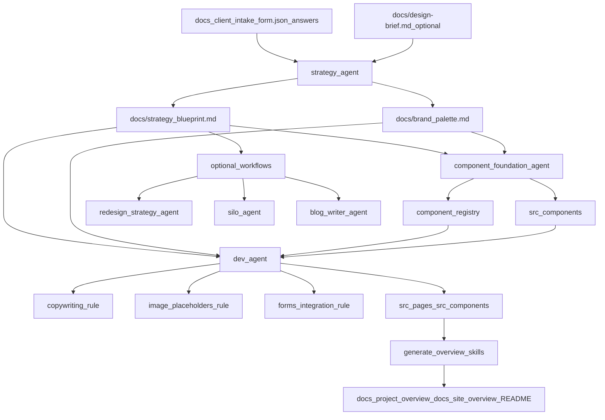

# `.claude` Framework

This directory is the canonical home for the project's reusable LLM framework. It is designed to work alongside the root-level `docs/` directory so agents can understand the site, follow the same workflow, and generate code or content in a predictable way.

## What Lives Here

- `rules/`: focused instructions that define standards, constraints, and reusable prompts
- `skills/`: specialist agent prompts for strategy, development, content, imagery, forms, launch prep, and optional silo workflows
- `client_intake_form_schema.json`: reference schema for the external intake form
- root `docs/`: project-specific inputs and outputs that agents read from or generate into
- root `CLAUDE.md`: stable entrypoint that points new agents into `docs/`, `.claude/`, and the working flow

## Source Of Truth

Use these artifacts in this order when they exist:

1. `docs/client_intake_form.json` → the completed client intake answer data
2. `docs/strategy_blueprint.md`
3. `docs/brand_palette.md`
4. project-specific supporting docs in `docs/` such as `design-brief.md`, `sitemap.md`, `navbar.md`, `footer.md`, `content/`, and silo manifests
5. the current codebase in `src/`, `public/`, and config files
6. `.claude/rules/*.md` for implementation and generation constraints
7. generated summaries such as `docs/project_overview.md` and `docs/site_overview.md`

Notes:

- `.claude` is canonical. Do not treat `.cursor` paths as source of truth in this repo.
- root `CLAUDE.md` is a navigation layer for agents, not a replacement for project-specific docs or source-of-truth artifacts.
- `.claude/client_intake_form_schema.json` is the reference contract for intake question IDs and expected answer shape.
- `docs/client_intake_form.json` is the actual answer data for the current project and should be treated as the first real source of truth.
- Rule files use `.md`, not `.mdc`.
- Some framework outputs are generated later and may not exist yet in a fresh project.
- Generated overview files are supportive summaries. They must not override strategy on brand, messaging, audience, or site structure.

## Recommended Flow

## Typical Pipeline

### 1. Intake and strategy

Start with client inputs in the root `docs/` directory, usually:

- `client_intake_form.json` containing the completed answer data for the current client
- `design-brief.md` if available
- optional logos, inspiration links, or legacy content

Run `strategy_agent` to translate raw inputs into:

- `docs/strategy_blueprint.md`
- `docs/brand_palette.md` when palette generation is needed

This stage defines the brand, audience, positioning, site structure, tone, and visual direction. Once it exists, `docs/strategy_blueprint.md` becomes the main source of truth for downstream copy and implementation decisions.

### 2. Component foundation

Use `component_foundation_agent` after the strategy docs exist and before broad page generation work. This workflow should:

- read strategy, palette, and optional design brief inputs
- read the component system, hierarchy, documentation, accessibility, color, and typography rules
- generate the approved component layer in `src/components/`
- publish `src/components/component-registry.json` as the machine-readable approved-component contract

### 3. Site implementation

Use `dev_agent` after the strategy docs exist. The development flow should:

- read strategy and palette docs first
- inspect `.claude/rules/` before major work
- inspect `src/components/component-registry.json` and the approved component layer first
- follow helper rules like `copywriting.md`, `image-placeholders.md`, `forms-integration.md`, and `accessibility.md`
- compose pages primarily from the approved component system
- only extend the component system when the page cannot be expressed cleanly with the approved set

### 4. Optional specialized workflows

Use these only when the project actually includes the required files and runtime support:

- `silo_agent`: large SEO silo programs driven by manifests and JSON page generation
- `blog_writer_agent`: MDX blog content workflows
- `image_generator_agent`: replacing placeholders with generated images
- `launch_checklist_agent`: launch readiness docs
- `generate-component-docs`: component API and usage documentation

### 5. Documentation regeneration

Use the generation skills after strategy or implementation changes:

- `skills/generate_overview/`: regenerate the broader project documentation set
- `skills/generate_site_overview/`: regenerate only `docs/site_overview.md`

Generated outputs may include:

- `docs/project_overview.md`
- `docs/site_overview.md`
- project `README.md`

If those files are missing in a starter project, that is expected until the generation flow is run.

## Rules vs Skills

Use a rule when the task needs a standard, guardrail, or reusable generation prompt.

Use a skill when the task needs a specialist workflow with a clear responsibility, inputs, and outputs.

In practice:

- rules answer "how should this be done?"
- skills answer "which agent should handle this work?"
- if a file is mostly a helper contract that `dev_agent` must obey, it should usually be a rule, not a top-level skill
- a foundation workflow that materializes reusable system assets belongs as a skill

## Directory Guide

### `rules/`

Key categories:

- implementation system rules: colors, typography, icons, component system, component hierarchy, component documentation, component registry, forms
- helper rules: copywriting, image placeholders, forms integration
- quality rules: accessibility and other cross-cutting standards
- content generation prompts: location pages, industry or service pages, long-form readability
- documentation compatibility rules: deprecated overview-generation redirects
- workflow helpers: silo sync

### `skills/`

Key specialists:

- `strategy_agent`: turns intake into strategy docs
- `redesign_strategy_agent`: strategy pass for redesigns
- `component_foundation_agent`: creates the approved reusable component layer from strategy and rules
- `dev_agent`: implementation lead for Astro + Tailwind + Preline work
- `generate_overview`: broader project documentation generation workflow
- `generate_site_overview`: site implementation summary workflow
- `image_generator_agent`: placeholder replacement workflow
- `blog_writer_agent`: blog MDX creation
- `silo_agent`: orchestrated silo page generation
- `launch_checklist_agent`: launch planning and verification

## Optional Workflow Requirements

Some skills assume supporting files that may not exist in every starter project.

Only enable the workflow when the project contains or is ready to create the needed files:

- component foundation workflow: `docs/strategy_blueprint.md`, `src/components/`, and the relevant component rules
- blog workflow: `src/content/blog/` and related blog routes/templates
- silo workflow: `docs/silo-manifest.json`, `docs/all-silos.md`, `src/components/SiloPage.astro`, `src/components/silo-registry.json`, and compatible types/components
- generated docs workflow: strategy docs plus enough codebase structure to summarize
- legacy redesign workflow: `docs/content/*.md` source content files

When a workflow is not enabled, treat those references as optional patterns rather than hard requirements.

## Example Content Policy

This framework intentionally keeps a few examples to show the expected shape of prompts and outputs.

Rules for examples:

- examples are illustrative placeholders, not project defaults
- replace brand names, locations, services, categories, and imagery with the current site's data
- do not assume any old client example is valid for a new project

## Conventions

- use Yarn commands, not npm or npx
- prefer project facts from `docs/` and the codebase over assumptions
- keep generated content and code aligned with the latest `.claude/rules/`
- if a file path is mentioned in a skill or rule, it should match the real repo layout

## Maintenance Checklist

When updating this framework:

- keep `.claude` paths accurate
- keep file extensions consistent as `.md`
- label examples clearly
- remove stale client-specific residue that could mislead future agents
- update this README whenever a skill, rule, or expected workflow changes
